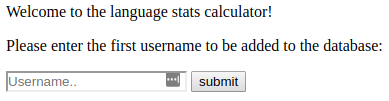
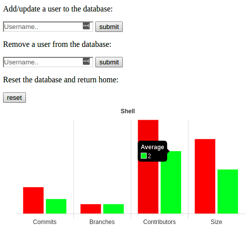

# Software-Engineering-GitHub-Interrogation--Python
Web application that interfaces the github API and displays statistics
representing the average number of commits, branches, contributors and size of repos containing each language that appears in the database.

## Dependencies
The application uses the MongoDB database management system.

The backend is built on Python3 and is dependent on the pymongo and pygithub libraries.

The front end is built using Node JS with the Express framework and graphs the
data using Chart JS.

In order to interrogate the Github API a valid access token must be copy/pasted
into the first line of a text file called accesstoken.txt.

## Usage
To start the program simple run the node server using the command:
node server.js in a terminal in the source folder.

By default the homepage is displayed on localhost:8080. This page consists of a
search bar which is used to add the first user to the database. When a user is added to the database, all of their repositories are checked and the data for each repository is used to update each language entry in the database.

From here, the user is brought to the stats page. This consists of another search
bar to add a user to the database and a search bar to remove a user from the database. Also, there is a Reset button which reinitialises the database and returns the user to the home screen.

Below this is a series of bar charts which display the average number of commits, branches, contributors and size of repositories containing each language in the database for the most recently entered user alongside the average for all users previously entered into the database.

